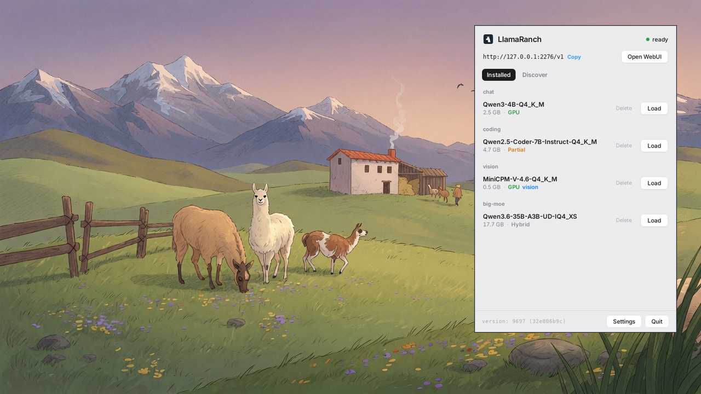

<div align="center">


# LlamaRanch

**A quiet ranch for your local models.**

Run [llama.cpp](https://github.com/ggml-org/llama.cpp) models from your tray, behind one private endpoint.
Load a model, chat. Nothing leaves your machine.

[**Website**](https://madalintat.github.io/LlamaRanch/) &nbsp;·&nbsp; [**Download**](https://github.com/madalintat/LlamaRanch/releases/latest) &nbsp;·&nbsp; [**Models on Hugging Face**](https://huggingface.co/models?apps=llama.cpp&sort=trending)




</div>

---

LlamaRanch runs AI models on your own hardware, nothing in the cloud. It keeps one
`llama-server` working quietly in the background and serves every model behind a single
OpenAI-compatible endpoint, so any app on your machine can talk to them. It is the Linux
companion to ggml-org's macOS app, [Llama](https://github.com/ggml-org/Llama-macOS).

## Platforms

| OS | App |
|----|-----|
| **Linux** | **LlamaRanch** (`.deb` / AppImage) |
| **Windows 10 / 11** | **LlamaRanch** (`.exe` installer) |
| **macOS** | [**Llama**](https://github.com/ggml-org/Llama-macOS), the original by ggml-org (`brew install --cask llamabarn`) |

## Install

Grab the latest build from [**Releases**](https://github.com/madalintat/LlamaRanch/releases/latest):

- **Linux:** `sudo dpkg -i LlamaRanch_*.deb` (or run the AppImage)
- **Windows 10 / 11:** download and run the `.exe` installer

Launch **LlamaRanch** from your apps, then turn on **Start on login** in Settings.

You also need a `llama-server` from llama.cpp ([Windows builds here](https://github.com/ggml-org/llama.cpp/releases/latest), CPU / CUDA / Vulkan), and on
Linux a system tray (i3bar, GNOME with AppIndicator, KDE, etc.).

## How it works

LlamaRanch runs a local server at `http://127.0.0.1:2276/v1`.

- **Add models** from the built-in catalog, or drop `.gguf` files in your models folder.
- **Connect any app** (chat UIs, editors, CLI tools, scripts) to the endpoint.
- **Models load when requested** and unload when idle.

It drives the prebuilt `llama-server` binary rather than embedding llama.cpp, so
you can update llama.cpp on your own schedule.

## Features

- **One click serving.** Load a model from the panel; it loads on demand and unloads when idle.
- **Hardware aware.** `--fit` sizes GPU layers and context to the memory you have. Nothing to tune.
- **Text and vision.** Multimodal models are detected and paired with their projector automatically.
- **Big models too.** Anything larger than your VRAM runs split across GPU and RAM.
- **Built in catalog.** Find and download models from Hugging Face, with a token for gated repos.
- **Fully local.** Nothing leaves your machine.

## Works with

LlamaRanch works with any OpenAI-compatible client. Just set the base URL to
`http://127.0.0.1:2276/v1`.

- **Chat UIs:** Open WebUI, Chatbox, and the built-in WebUI at `http://127.0.0.1:2276`
- **Editors:** VS Code, Zed
- **Editor extensions:** Continue, Cline
- **CLI tools and scripts:** curl, the OpenAI SDKs, etc.

## API examples

```sh
# list models
curl http://127.0.0.1:2276/v1/models

# chat with a model (use any id from /v1/models)
curl http://127.0.0.1:2276/v1/chat/completions \
  -H 'Content-Type: application/json' \
  -d '{"model":"Qwen3-4B-Q4_K_M","messages":[{"role":"user","content":"Hello"}]}'
```

Full API reference is in the [llama-server docs](https://github.com/ggml-org/llama.cpp/blob/master/tools/server/README.md).

## Settings

Settings live in the panel and in `~/.config/llamaranch/config.json`:

- **Port** and **models directory**
- **llama-server path**
- **Idle timeout** (unload a model after N seconds, 0 to keep it loaded)
- **Hugging Face token** (for gated downloads)
- **Expose to network.** By default the server is only reachable from your machine
  (`127.0.0.1`). Enabling this binds `0.0.0.0` so other devices on your network can
  connect. Only enable it if you understand the security risks.

## Models

Drop any `.gguf` in your models folder, or grab one from the **Discover** tab.

<a href="https://huggingface.co/models?apps=llama.cpp&sort=trending"> Models that run on llama.cpp</a>
&nbsp;·&nbsp;
<a href="https://huggingface.co/ggml-org">Official GGUFs from ggml-org</a>

## Build from source

```sh
git clone https://github.com/madalintat/LlamaRanch
cd LlamaRanch
npm install
npm run tauri build -- --no-bundle      # run ./src-tauri/target/release/llamaranch
npm run tauri build -- --bundles deb    # or build the .deb
```

Needs Rust, Node 18+, and (on Debian/Ubuntu) the Tauri system libraries:

```sh
sudo apt-get install -y libwebkit2gtk-4.1-dev libgtk-3-dev \
  libayatana-appindicator3-dev librsvg2-dev libsoup-3.0-dev \
  build-essential curl wget file libssl-dev libxdo-dev patchelf
```

## Roadmap

- Windows build
- A larger model catalog
- Multiple models loaded at once
- Per-model configuration (context length, sampling)

## Contributing

Bug reports, fixes, new catalog models, and features are all welcome. See
[CONTRIBUTING.md](CONTRIBUTING.md) for the project layout and how to build and test.

## Credits

Built on [llama.cpp](https://github.com/ggml-org/llama.cpp) by ggml-org, and
inspired by their macOS app [Llama](https://github.com/ggml-org/Llama-macOS).

MIT licensed.
