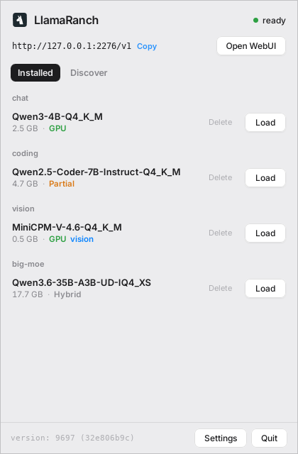

<div align="center">


# LlamaRanch

**A cosy home for your LLMs, on Linux.**

Run local models with [llama.cpp](https://github.com/ggml-org/llama.cpp) from your system tray.
Pick a model, click load, chat.

[**Website**](https://madalintat.github.io/LlamaRanch/) &nbsp;·&nbsp; [**Download**](https://github.com/madalintat/LlamaRanch/releases/latest) &nbsp;·&nbsp; [**Models on Hugging Face**](https://huggingface.co/models?apps=llama.cpp&sort=trending)




</div>

---

LlamaRanch is a small tray app that runs one `llama-server` in the background and
serves every model behind a single OpenAI-compatible endpoint. It is a Linux take
on the macOS [LlamaBarn](https://github.com/ggml-org/Llama-macOS).

## Features

- **One click serving.** Load a model from the panel. It loads on demand and unloads when idle.
- **Hardware aware.** `--fit` sizes GPU layers and context to the memory you have. Nothing to tune.
- **Text and vision.** Multimodal models are detected and paired with their projector automatically.
- **Big models too.** Anything larger than your VRAM runs split across GPU and RAM.
- **OpenAI compatible.** Point Continue, Zed, Open WebUI, or your own scripts at `http://127.0.0.1:2276/v1`.
- **Built in catalog.** Find and download models from Hugging Face, with a token for gated repos.
- **Fully local.** Nothing leaves your machine.

## Download

Grab the latest `.deb` from [**Releases**](https://github.com/madalintat/LlamaRanch/releases/latest):

```sh
sudo dpkg -i LlamaRanch_0.1.0_amd64.deb
```

Launch **LlamaRanch** from your app menu, then turn on **Start on login** in Settings.

## Build from source

```sh
git clone https://github.com/madalintat/LlamaRanch
cd LlamaRanch
npm install
npm run tauri build -- --no-bundle
./src-tauri/target/release/llamaranch
```

You need Rust, Node 18+, a built `llama-server`, and (on Debian/Ubuntu) the Tauri
system libraries:

```sh
sudo apt-get install -y libwebkit2gtk-4.1-dev libgtk-3-dev \
  libayatana-appindicator3-dev librsvg2-dev libsoup-3.0-dev \
  build-essential curl wget file libssl-dev libxdo-dev patchelf
```

To build the package yourself: `npm run tauri build -- --bundles deb`.

## Connect any app

The server speaks the OpenAI API, so any compatible client works once you set the
base URL:

```sh
curl http://127.0.0.1:2276/v1/chat/completions \
  -H 'Content-Type: application/json' \
  -d '{"model":"Qwen3-4B-Q4_K_M","messages":[{"role":"user","content":"hi"}]}'
```

Or click **Open WebUI** in the panel to chat in your browser.

## Models

Drop any `.gguf` in your models folder, or grab one from the **Discover** tab.
Anything that runs in llama.cpp runs here.

<a href="https://huggingface.co/models?apps=llama.cpp&sort=trending"> Models that run on llama.cpp</a>
&nbsp;·&nbsp;
<a href="https://huggingface.co/ggml-org">Official GGUFs from ggml-org</a>

## Settings

Settings live in `~/.config/llamaranch/config.json`: port, models directory,
`llama-server` path, idle timeout, network exposure, and Hugging Face token.

## License

MIT
