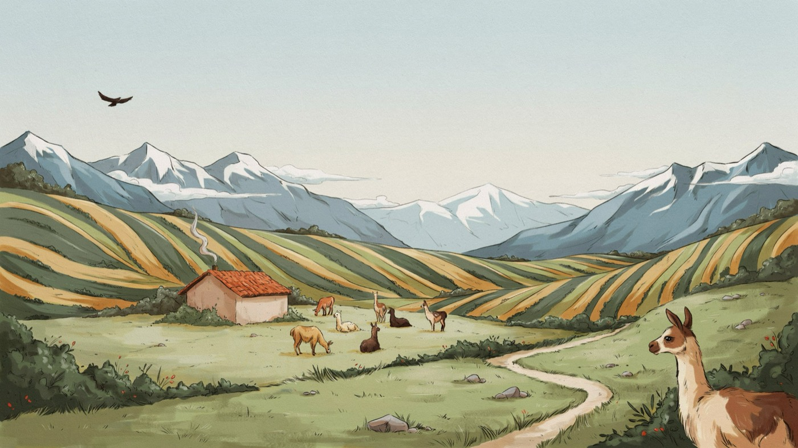

<div align="center">


# LlamaRanch

**A quiet ranch for your local models.**

Run AI on your own hardware. One private endpoint. Nothing leaves the valley.

[**Website**](https://madalintat.github.io/LlamaRanch/) &nbsp;·&nbsp; [**Download**](https://github.com/madalintat/LlamaRanch/releases/latest) &nbsp;·&nbsp; [**Models on Hugging Face**](https://huggingface.co/models?apps=llama.cpp&sort=trending)




</div>

---

LlamaRanch runs [llama.cpp](https://github.com/ggml-org/llama.cpp) models on your own hardware behind a single, private OpenAI-compatible endpoint — `http://127.0.0.1:2276/v1`. Any app, IDE, or SDK that speaks OpenAI can connect to it. There's a built-in chat that routes each conversation to the right local model, swaps experts to fit your memory, and can call tools — all without sending a byte off your machine.

## What it is

LlamaRanch is a local AI runner and agent harness. It manages one or more `llama-server` processes, keeps models loaded on demand, and exposes everything through one clean endpoint. The built-in chat adds expert routing, hot-swapping, and a sandboxed tool loop on top — so you get something closer to an agent than a plain model server, while staying fully local.

## Features

### One private OpenAI-compatible endpoint

`http://127.0.0.1:2276/v1` — chat completions, embeddings, model listing. Drop it into Open WebUI, Continue, Zed, Cline, a curl script, or any OpenAI SDK and it just works.

### Multiple models at once, hardware-aware

Load more than one model at the same time. LlamaRanch uses llama.cpp's `--fit` flag to size GPU layers and context to the memory you actually have — nothing to tune by hand. Models load on demand and can be unloaded when you're done.

### Expert auto-routing and hot-swap

The built-in chat routes each task to the best local model for the job — general, code, reasoning, or vision — and swaps experts in and out of memory to keep things running on modest hardware. A small general model stays warm so replies start immediately. Pin a specific model anytime with **⌘K**.

### Per-model configuration

Set context length and sampling parameters independently per model. Live memory estimates update as you adjust, so you always know what will fit.

### Built-in chat agent with tools

A local-first tool loop, sandboxed and auditable:

| Tool | What it does | Privacy |
|------|-------------|---------|
| `read_file` | Read files from folder-allowlisted paths | LOCAL |
| `web_fetch` | Fetch a URL (SSRF-protected) | ONLINE |
| `web_search` | Search via your own SearXNG instance | ONLINE (opt-in, off by default) |

A privacy panel shows exactly which tools are LOCAL vs ONLINE, and an **Offline** switch cuts all internet access for tools in one click.

### ⌘K command bar

Switch models from anywhere in the app — mid-conversation, mid-task.

### Richer model catalog

25+ curated, hardware-appropriate GGUF models. One-click download, with Hugging Face token support for gated repos. Drop any `.gguf` file into your models folder and it appears automatically.

### New design

A warm, paper-and-ink interface with a live "dither" material, follow-OS light/dark mode, and three typefaces (Newsreader, Instrument Sans, JetBrains Mono) — all bundled, all offline.

## Platforms

| OS | Arch | Installers |
|----|------|-----------|
| **macOS** | Apple Silicon | `.dmg`, signed |
| **Linux** | x86_64, arm64 | `.deb`, `.AppImage`, `.rpm` |
| **Windows** | x86_64, Arm | `.exe`, `.msi` |

All platforms are first-class. Signed releases, in-app auto-update.

## Install

Download from [**Releases**](https://github.com/madalintat/LlamaRanch/releases/latest) for your OS.

You also need a `llama-server` binary from llama.cpp:

- **macOS:** `brew install llama.cpp`
- **Linux / Windows:** grab a prebuilt from [llama.cpp Releases](https://github.com/ggml-org/llama.cpp/releases/latest) (CPU, CUDA, Vulkan, Metal)

First run: LlamaRanch auto-detects `llama-server` on your PATH. Open the popover, pick a model from the catalog (or drop a `.gguf` into your models folder), load it, and start chatting.

## How it works

LlamaRanch manages a `llama-server` process and routes all traffic through `127.0.0.1:2276/v1`. The built-in chat (the "brain") handles model lifecycle — loading, unloading, hot-swapping — and runs the tool loop locally with observation masking before responses reach the UI. Nothing is relayed to an external service.

```sh
# list loaded models
curl http://127.0.0.1:2276/v1/models

# chat
curl http://127.0.0.1:2276/v1/chat/completions \
  -H 'Content-Type: application/json' \
  -d '{"model":"Qwen3-4B-Q4_K_M","messages":[{"role":"user","content":"Hello"}]}'
```

Full API reference: [llama-server docs](https://github.com/ggml-org/llama.cpp/blob/master/tools/server/README.md).

## Privacy

LlamaRanch is 100% local by default. Every tool is tagged LOCAL or ONLINE in the privacy panel. Enable **Offline mode** to prevent any tool from reaching the internet — the switch is always one click away.

## Roadmap

**Done**

- macOS, Linux, and Windows app — all first-class
- Multiple models loaded at once
- Per-model context and sampling configuration
- Unified model management and 25+ model catalog
- ARM64 builds (Linux and Windows on Arm)
- Whole-app brand redesign
- Agent chat with expert routing, hot-swap, sandboxed tool loop, and observation masking

**Next**

- **MCP** — connect external tool servers to the local agent
- **Knowledge base / RAG** — local embeddings and retrieval
- **Skills and persistent memory**
- More web-search providers
- Local **API gateway**

## Build from source

Needs Rust, Node 18+, and a `llama-server` on your PATH. See the [Tauri prerequisites](https://v2.tauri.app/start/prerequisites/) for your OS.

```sh
git clone https://github.com/madalintat/LlamaRanch
cd LlamaRanch
npm install
npm run tauri dev      # hot-reload dev loop
npm run tauri build    # production build
```

## Credits

Built on [llama.cpp](https://github.com/ggml-org/llama.cpp) by ggml-org — the engine that makes fast, local inference possible. Inspired by their macOS app [Llama](https://github.com/ggml-org/Llama-macOS).

Fonts: [Newsreader](https://fonts.google.com/specimen/Newsreader), [Instrument Sans](https://fonts.google.com/specimen/Instrument+Sans), [JetBrains Mono](https://www.jetbrains.com/legalnotices/jetbrains_mono/) — all bundled, offline.

MIT licensed.
