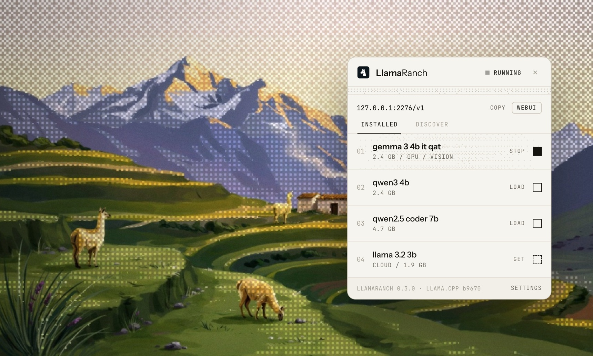

<div align="center">


# LlamaRanch

**A quiet ranch for your local models.**

Run AI on your own hardware. One private endpoint. Nothing leaves the valley.

[**Website**](https://madalintat.github.io/LlamaRanch/) &nbsp;·&nbsp; [**Documentation**](https://madalintat.github.io/LlamaRanch/docs/) &nbsp;·&nbsp; [**Download**](https://github.com/madalintat/LlamaRanch/releases/latest) &nbsp;·&nbsp; [**Models on Hugging Face**](https://huggingface.co/models?apps=llama.cpp&sort=trending)




</div>

---

LlamaRanch keeps your [llama.cpp](https://github.com/ggml-org/llama.cpp) models running behind one private, OpenAI-compatible endpoint at `http://127.0.0.1:2276/v1`. Point any app, IDE, or SDK that speaks OpenAI at it and it just works. There's also a built-in chat that picks the right local model for each turn, swaps experts in and out to fit your memory, and reaches for tools when it needs them. None of it leaves your machine.

## Documentation

Full documentation lives at [**madalintat.github.io/LlamaRanch/docs/**](https://madalintat.github.io/LlamaRanch/docs/). It covers the quick start wizard, manual install, the endpoint API, model management, the chat agent, tools, configuration reference, and roadmap.

## What it is

Two things behind one tray icon. A model server that runs many GGUF models on a single endpoint, and an agent on top of it that routes, loads, and calls tools for you. Local by default, online only when you say so.

## Features

### One private endpoint

`http://127.0.0.1:2276/v1` speaks chat completions, embeddings, and model listing. Drop it into Open WebUI, Continue, Zed, Cline, a curl script, or any OpenAI SDK. No keys, no rewrites.

### Many models, sized to your machine

Run more than one model at a time. LlamaRanch uses llama.cpp's `--fit` to size GPU layers and context to the memory you actually have, so there's nothing to tune by hand. Models load when asked and unload when idle.

### Routing and hot-swap

The chat reads each task and hands it to the model that suits it (general, code, reasoning, or vision), swapping experts in and out so even a modest machine keeps up. A small general model stays warm, so the first token comes fast. Want to drive? Pin any model yourself with ⌘K.

### Per-model config

Context length and sampling live per model, with a running memory estimate as you change them. You always know what fits before you load it.

### A chat agent with tools

A sandboxed, local-first tool loop:

| Tool | What it does | Privacy |
|------|--------------|---------|
| `read_file` | Reads files from folders you've allowed | LOCAL |
| `web_fetch` | Fetches a URL, with private-network access blocked | ONLINE |
| `web_search` | Searches through your own SearXNG instance | ONLINE (opt-in, off by default) |

A privacy panel spells out which tool is LOCAL and which is ONLINE. One Offline switch cuts every tool off the internet at once.

### ⌘K command bar

Switch models from anywhere in the app, mid-conversation or mid-task.

### A real catalog

25+ curated GGUF models, picked to fit common hardware, one click to download (add a Hugging Face token for gated repos). Drop your own `.gguf` into the models folder and it shows up on its own.

### A design of its own

Warm paper and ink, a live "dither" texture, light and dark that follow your system, and three bundled typefaces (Newsreader, Instrument Sans, JetBrains Mono). All offline. No web fonts, nothing phones home.

## Platforms

| OS | Arch | Installers |
|----|------|-----------|
| **macOS** | Apple Silicon | `.dmg` |
| **Linux** | x86_64, arm64 | `.deb`, `.AppImage`, `.rpm` |
| **Windows** | x86_64, Arm | `.exe`, `.msi` |

Every platform is first class and updates itself in place (see [Updating](#updating)). macOS builds are ad-hoc signed but not yet notarized, so on first launch right-click the app and choose **Open**.

## Install

### The fast way: one command

```sh
npx @llamaranch/wizard
```

Runs on macOS, Linux, and Windows. The wizard detects your hardware, installs llama.cpp with the right backend, suggests and downloads models that fit your memory, writes your config, and installs the LlamaRanch app. When it finishes, open the app and everything is ready. If a step can't run on its own (no Homebrew, an odd distro), it tells you exactly what to do by hand. Want it headless on a server? `npx @llamaranch/wizard serve` starts the endpoint straight from the terminal.

### By hand

Grab your build from [**Releases**](https://github.com/madalintat/LlamaRanch/releases/latest). You'll also need a `llama-server` from llama.cpp:

- **macOS:** `brew install llama.cpp`
- **Linux / Windows:** a prebuilt from [llama.cpp Releases](https://github.com/ggml-org/llama.cpp/releases/latest) (CPU, CUDA, Vulkan, Metal)

First run finds `llama-server` on your PATH. Open the tray popover, pick a model from the catalog (or drop in a `.gguf`), load it, and start chatting.

## Updating

The quickest way, on any OS:

```sh
npx @llamaranch/wizard update
```

It pulls the latest release and reinstalls the app for you. The app also updates itself: LlamaRanch checks [Releases](https://github.com/madalintat/LlamaRanch/releases/latest) when it starts, and when a newer signed build is out a banner appears inside the app.

- **macOS `.dmg`, Windows `.exe` / `.msi`, and the Linux `.AppImage`** update in place. Click **Update** in the banner; the app downloads the new build, checks its signature, and relaunches into it.
- **Linux `.deb`:** download the new package from Releases and install it over the old one: `sudo dpkg -i LlamaRanch_*.deb`.
- **Linux `.rpm`:** download it and run `sudo rpm -Uvh LlamaRanch-*.rpm` (or `sudo dnf install ./LlamaRanch-*.rpm`).

Every update is checked against the signing key, so a tampered build won't install. To stay on a specific version, just download it from Releases.

## How it works

One `llama-server` does the inference; LlamaRanch drives it. The chat (the "brain") owns the model lifecycle (load, unload, hot-swap) and runs the tool loop locally, trimming old tool output before it reaches the model so long sessions stay sharp. Nothing is relayed to an outside service.

```sh
# list loaded models
curl http://127.0.0.1:2276/v1/models

# chat
curl http://127.0.0.1:2276/v1/chat/completions \
  -H 'Content-Type: application/json' \
  -d '{"model":"Qwen3-4B-Q4_K_M","messages":[{"role":"user","content":"Hello"}]}'
```

Full API reference: [llama-server docs](https://github.com/ggml-org/llama.cpp/blob/master/tools/server/README.md).

## Privacy

Local by default, full stop. Every tool wears a LOCAL or ONLINE tag in the privacy panel. Flip Offline mode and no tool can touch the internet. The switch is always one click away.

## Roadmap

**Shipped**

- macOS, Linux, and Windows apps, all first class
- Multiple models loaded at once
- Per-model context and sampling
- Unified model management and a 25+ model catalog
- ARM64 builds (Linux and Windows on Arm)
- A whole-app brand redesign
- A chat agent: expert routing, hot-swap, a sandboxed tool loop, and observation masking

**Next**

- **MCP:** connect external tool servers to the local agent
- **Knowledge base (RAG):** local embeddings and retrieval
- **Skills and persistent memory**
- More web-search providers
- A local **API gateway**

## Build from source

Needs Rust, Node, and a `llama-server` on your PATH. The [Tauri prerequisites](https://v2.tauri.app/start/prerequisites/) page lists current minimums for your OS.

```sh
git clone https://github.com/madalintat/LlamaRanch
cd LlamaRanch
npm install
npm run tauri dev      # hot-reload dev loop
npm run tauri build    # production build
```

## Credits

Built on [llama.cpp](https://github.com/ggml-org/llama.cpp) by ggml-org, the project that makes local inference fast. Kin to their macOS app, [Llama](https://github.com/ggml-org/Llama-macOS).

Fonts: [Newsreader](https://fonts.google.com/specimen/Newsreader), [Instrument Sans](https://fonts.google.com/specimen/Instrument+Sans), [JetBrains Mono](https://www.jetbrains.com/legalnotices/jetbrains_mono/), all bundled and offline.

MIT licensed.
